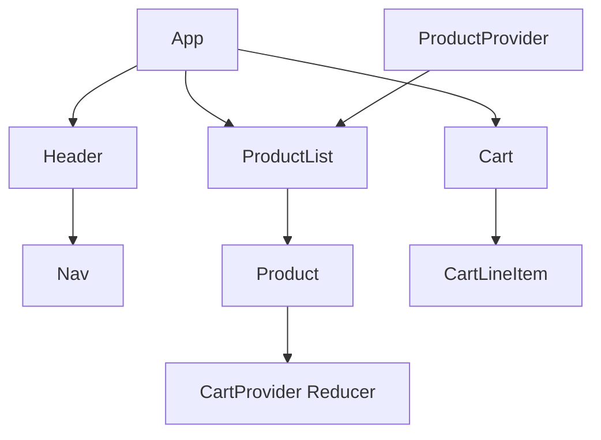

# Prime Co Shopping Cart Lab

> Modern retail preview built with React 19, TypeScript 5.9, and Vite 8 � a single-page dashboard that walks users through product discovery, cart management, and a mock checkout in under 30 seconds.

**Why it matters**
- Real-time totals + reducer-backed cart state keep pricing accurate as visitors toggle between products and the cart view.
- Self-contained stack (static JSON catalog + client-side logic) is ideal for prototyping checkout concepts before wiring in a backend.

## Getting Started
| Section | Anchor |
| --- | --- |
| Overview | [#overview](#overview) |
| Setup | [#setup](#setup) |
| Usage | [#usage](#usage) |
| Visuals | [#visuals](#visuals) |
| FAQ | [#faq](#faq) |
| Notes | [#notes](#notes) |
| Contributing | [#contributing](#contributing) |

## Overview {#overview}
- **Goals:** Showcase a lightweight consumer-facing cart where users can flip between browsing and reviewing their order, adjust quantities, and submit a mock purchase.
- **Stack:** React 19 + Vite 8 (beta) + TypeScript 5.9, powered by the `@vitejs/plugin-react` compiler configuration (with `babel-plugin-react-compiler`), plus ESLint 9.x for consistency.
- **Architecture:** `App` hosts a `Header`, `ProductList`, and `Cart`. `ProductProvider` injects the catalog (seeded from `data/products.json`), while `CartProvider` exposes reducer-driven actions (`ADD`, `REMOVE`, `QUANTITY`, `SUBMIT`). Memoized `Product` and `CartLineItem` components reduce re-renders, and the `Nav` component flips the `viewCart` toggle stored in `App`.

> **Tip:** The cart context memoizes the reducer action map so child components receive stable action constants, keeping the memo comparisons effective.

## Setup {#setup}
### Prerequisites
-  Node.js LTS (Windows/macOS/Linux friendly)
-  npm 10+ (delivered with Node.js)

### Install & bootstrap
```bash
npm install
```
> The `node_modules` folder is already present for reference, but reinstalling keeps local tooling aligned when dependencies change.

### Configuration
- **Environment variables:** none required. The product catalog is read from `data/products.json`, and image assets live under `src/images/{id}.jpg`.
- **Secrets:** there are no secrets; this is a pure front-end prototype.

### Build & tooling commands
```bash
npm run dev       # start Vite dev server (default http://localhost:5173)
npm run build     # produce production bundle (runs TypeScript project build + Vite)
npm run lint      # run ESLint over the entire src tree
npm run preview   # test the production bundle locally
```

## Usage {#usage}
1. Run `npm run dev` and visit `http://localhost:5173` in your browser.
2. Browse products in the default view. Each `Product` renders a hero image (from `src/images/`) and an �Add to Cart� button plus price formatting via `Intl.NumberFormat`.
3. Click **View Cart** in the navigation to inspect line items.
   - Adjust quantities using the `<select>` dropdown (up to 20 or the current quantity, whichever is higher).
   - Remove items with the **delete** button.
   - Totals (`totalItems`, `Totalprice`) update via `useCart`�s reducer state.
4. Press **Place Order** to dispatch the `SUBMIT` action, which clears the cart and surfaces a thank-you confirmation.

### Sample commands + expectations
- `npm run dev` ? dev server logs `Local: http://localhost:5173`; verifying the page loads with product tiles.
- `npm run build` ? emits `dist/` bundle; success message indicates assets compiled.
- `npm run lint` ? ESLint reports zero warnings (or highlights files needing formatting).

### Health checks & verification
- The app is effectively a client-only SPA; verifying `npm run build` and `npm run preview` ensures bundling succeeds.
- Unit tests are not present, so run the lint/build commands before deployment to confirm no type issues.

## Visuals {#visuals}

*Caption: Static hero image used by each `Product` card to simulate product photography (IDs 1�3). Replace these JPGs when real assets arrive.*


*Caption: Component/context topology. `ProductProvider` seeds the catalog, while `CartProvider` exposes the reducer actions that both `Product` and `CartLineItem` dispatch.*

## FAQ {#faq}
#### How do I deploy this bundle?
Run `npm run build` to produce the `dist/` folder, then serve it via any static host (Vercel, Netlify, GitHub Pages). Use `npm run preview` locally to confirm the minified output renders before deploying.

#### Why do totals reset when I click �Place Order�?
The `SUBMIT` action in `CartProvider` returns an empty cart array. It�s a placeholder for where you�d normally call a checkout API; you can extend it to clear the cart only after a successful network response.

#### What if I need a real products API?
Swap the `initState` in `ProductsProvider` for a `fetch` call (commented out in the file). Add `.env` variables such as `VITE_PRODUCTS_URL` and guard the fetch with a try/catch so the UI can fall back to the bundled JSON catalog.

## Contributing {#contributing}
- **Code style:** TypeScript + React 19 with ESLint 9.x; follow the existing reducer/action patterns and keep components memoized when they receive derived props.
- **Testing:** There are no automated tests yet�run `npm run lint` and `npm run build` locally before opening a PR.
- **Workflow:**
  1. Fork/clone the repo and run `npm install`.
  2. Make changes in a feature branch (`codex/branch-name`).
  3. Run `npm run lint` and `npm run build`.
  4. Open a PR describing the goal, testing commands executed, and any visual regressions.
  5. Add screenshots or recorded GIFs under `public/` if the UI changes.


